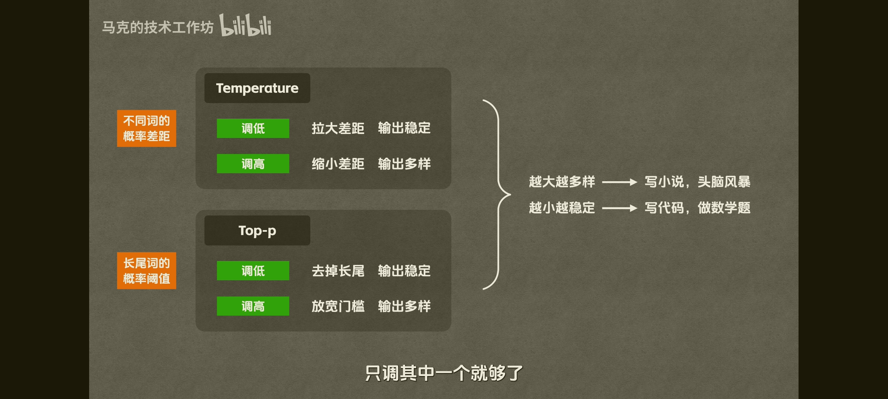

# Week 1 学习笔记

## 目录

- [1. BPE 分词算法原理](#1-bpe-分词算法原理)
- [2. 常见问题记录](#2-常见问题记录)
- [3. Ollama 常用命令](#3-ollama-常用命令)
- [4. Temperature 与 Top-p 参数详解](#4-temperature-与-top-p-参数详解)
- [5. 参数调优总结 (实战优先级)](#5-参数调优总结-实战优先级)

---

## 1. BPE 分词算法原理

BPE（Byte Pair Encoding，字节对编码）是目前几乎所有主流大模型（GPT-4、Claude、DeepSeek、Qwen 等）使用的底层分词算法。

### 1.1 一句话概括

BPE 的核心思想是："找出文本中最常相邻出现的两个符号，把它们合并成一个新的符号；不断重复，直到达到预设的词表大小。"

它是一种**子词（Subword）**分词法，介于"按字符分词"和"按词分词"之间。

### 1.2 为什么要发明 BPE？

| 方式 | 痛点 |
|------|------|
| 按词分词 | 词表巨大，遇到生僻词无法处理 (OOV) |
| 按字符分词 | 序列太长，浪费上下文窗口，缺乏语义 |
| BPE | 高频词保留整体，低频词拆为子词，兼顾两者 |

### 1.3 算法运作流程

假设训练语料：`low`(5次)、`lowest`(2次)、`newer`(6次)、`wider`(3次)

1. **初始化词表** — 只有单个字符：{l, o, w, e, s, t, n, r, i, d}
2. **统计相邻字符对频率** — `e+r` 出现 9 次最高
3. **合并最高频对** — `er` 成为新 Token
4. **重复** — 直到达到词表上限

### 1.4 应用于新文本

训练后得到"合并规则表"。对从没见过的词 `lower`：
- 拆成字符：`l o w e r`
- 按规则合并：`l o w er` → `lo w er` → `low er`
- 结果：两个 Token `low` + `er`（模型理解了构词规律）

### 1.5 Byte-Level BPE (BBPE)

GPT-2 之后的改进：
- 基础单位从"字符"改为"256 个字节 (0x00-0xFF)"
- 好处：永远不会出现无法识别的字符
- 高频汉字的 3 个字节会被合并成 1 个 Token；罕见字退化为 3 个 Token

### 1.6 工程启发

1. **中文更贵** — 中文字符通常 1 字 ≈ 1.5-2 Token，英文单词常常 1 词 = 1 Token
2. **数学计算弱** — 数字 `314159` 可能被 BPE 随机切割，丢失位数感知
3. **tiktoken 库** — 调用的就是训练好的 BPE 合并规则表

---

## 2. 常见问题记录

- 遇到了 503 限流错误，生产环境需要重试机制和友好错误信息

---

## 3. Ollama 常用命令

| 命令 | 作用 |
|------|------|
| `ollama pull qwen3:4b` | 下载模型 |
| `ollama run qwen3:4b` | 交互式对话（临时） |
| `ollama ls` | 列出已下载的模型 |
| `ollama ps` | 查看当前加载到内存中的模型 |
| `ollama rm qwen3:4b` | 删除模型 |
| `ollama show qwen3:4b` | 查看模型信息 |
| `ollama serve` | 手动启动 API 服务 |

### 3.1 服务管理 (systemd)

```bash
sudo systemctl status ollama    # 查看状态
sudo systemctl start ollama     # 启动
sudo systemctl stop ollama      # 停止
sudo systemctl restart ollama   # 重启
```

- API 地址: `http://localhost:11434`
- OpenAI 兼容端点: `http://localhost:11434/v1/chat/completions`
- 模型按需加载到内存，空闲几分钟自动卸载

---

## 4. Temperature 与 Top-p 参数详解

> 来源: 阿里百炼文档

### 4.1 控制回复多样性

`temperature` 和 `top_p` 用于控制生成文本的多样性。数值越高，内容越多样；数值越低，内容越确定。**建议每次只调整一个。**

- **temperature**: 范围 [0, 2)。侧重调整随机性。
- **top_p**: 范围 [0, 1]。通过概率阈值筛选回复。

### 4.2 效果对比

输入提示词: "写一个三句话的短故事，主角是一只猫和一束阳光。"

**高多样性 (temperature=0.9):** 适用于创意写作、头脑风暴、营销文案。

> 阳光斜斜地切进窗台，橘猫蹑手蹑脚走近那块发光的方砖，绒毛瞬间被染成熔化的蜜糖。
> 它伸出前爪轻拍光斑，却像踩进温热的池水般陷了进去，整片阳光顺着肉垫汩汩漫上脊背。
> 午后忽然变得很重——猫儿蜷在流动的金砂里，听见时光在呼噜声中轻轻融化。

**高确定性 (temperature=0.1):** 适用于事实问答、代码生成、法律文本。

> 午后，一只老猫蜷在窗台，数着光斑打盹。
> 阳光轻轻跃过它斑驳的脊背，像在翻阅一本旧相册。
> 尘埃浮起又落下，仿佛时光低语：你曾年轻，我也炽热。

### 4.3 原理



**temperature:**
- 越高 → Token 概率分布更平坦，低概率词也有机会被选中，输出更随机
- 越低 → 概率分布更陡峭，高概率词被选中的概率更高，输出更确定

**top_p:**
- 将候选 Token 按概率从高到低排序，累加概率直到达到阈值，从这个集合中随机选一个
- 越高 → 考虑的 Token 越多，输出越多样
- 越低 → 考虑的 Token 越少，输出越集中确定

### 4.4 不同场景的推荐配置

```python
SCENARIO_CONFIGS = {
    "creative_writing": {"temperature": 0.9, "top_p": 0.95},  # 创造性写作
    "code_generation":  {"temperature": 0.2, "top_p": 0.8},   # 代码生成
    "factual_qa":       {"temperature": 0.1, "top_p": 0.7},   # 事实性问答
    "translation":      {"temperature": 0.3, "top_p": 0.8},   # 翻译
}
```

---

## 5. 参数调优总结 (实战优先级)

### 5.1 真正常用的参数

| 优先级 | 参数 | 什么时候调 |
|--------|------|-----------|
| 每次都要决定 | `model` | 选对模型比调参重要 10 倍 |
| 每次都要决定 | prompt / system instructions | 效果远大于任何参数调整 |
| 经常用 | `temperature` | 确定性任务调低, 创意任务调高 |
| 经常用 | `max_completion_tokens` | 控制成本和输出长度 |
| 偶尔用 | `response_format` | 需要结构化输出时 (第3周学) |
| 偶尔用 | `tools` | Agent/函数调用时 (第4周学) |
| 很少单独调 | `top_p` | 保持默认 0.9 即可 |
| 遇到问题才调 | `frequency_penalty` | 模型重复啰嗦时 |
| 遇到问题才调 | `presence_penalty` | 需要话题发散时 |
| 特定场景 | `stop` | 只要前 N 项/遇到标记就停 |

### 5.2 实用调参顺序

1. 先固定模型和提示词
2. 用默认参数跑真实样本
3. 先解决 prompt 和上下文问题
4. 再调输出长度
5. 创作类任务调 temperature
6. 最后才尝试 penalty 参数

### 5.3 核心认识

- `frequency_penalty` / `presence_penalty` 是"治病"用的，模型没问题时感知不到效果
- 生产开发中最值得掌握的是：**模型选择 > 提示词 > 结构化输出 > 工具调用 > 采样参数**
